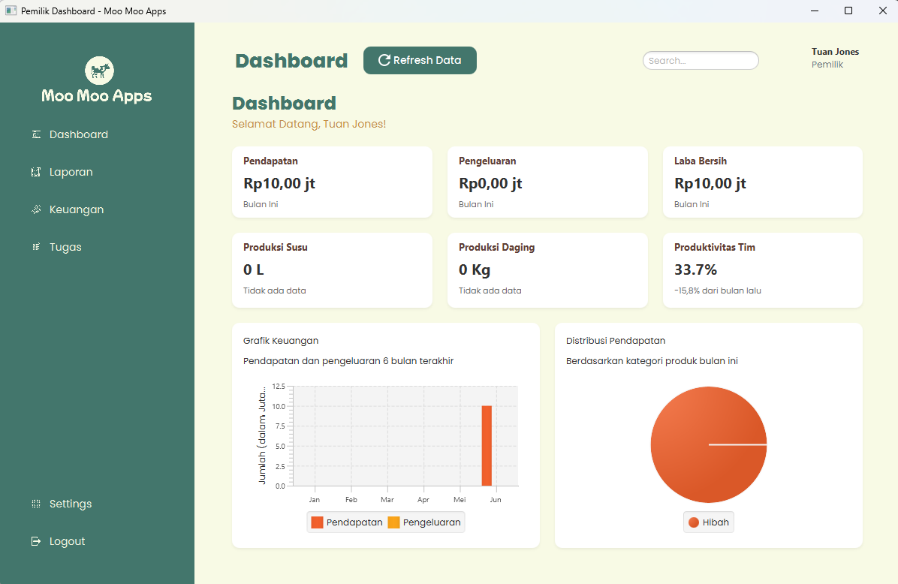
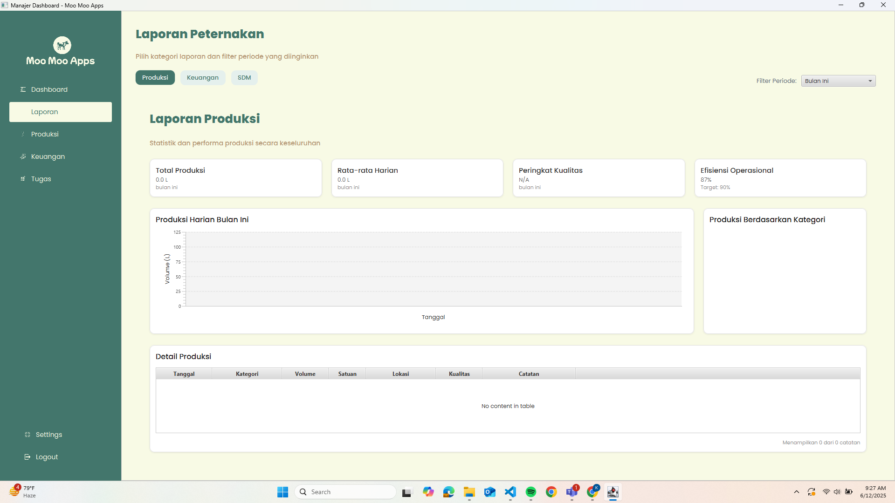

# IF2050-Tubes-DRPL-K1I

## Penjelasan Singkat Mengenai Aplikasi

**Moo Moo Apps** adalah aplikasi manajemen digital terintegrasi yang dirancang untuk membantu pemilik usaha peternakan dan pertanian dalam mengelola seluruh aspek operasional bisnis. Aplikasi ini mencakup fitur pencatatan produksi secara real-time, pengelolaan keuangan, dan manajemen karyawan.

Dengan Moo Moo Apps, pengguna dapat:
- Mencatat hasil produksi pertanian dan peternakan secara efisien
- Mengelola pemasukan, pengeluaran, penggajian, dan biaya operasional lainnya
- Memantau kehadiran serta distribusi tugas karyawan
- Mengakses laporan analisis operasional otomatis untuk mendukung pengambilan keputusan berbasis data

Moo Moo Apps bertujuan untuk meningkatkan efisiensi kerja, koordinasi tim, serta membantu pemilik usaha membuat keputusan strategis secara tepat dan terstruktur.

## Cara Menjalankan Aplikasi MooMooApps
Untuk dapat menjalankan MooMooApps, ada beberapa hal yang perlu kamu siapkan dan lakukan. Ikuti langkah-langkah di bawah ini ya!
#### Prasyarat

* **Java**: Aplikasi ini dibuat dengan bahasa Java, jadi pastikan kamu sudah menginstalnya.
* **Git**: Dibutuhkan untuk mengambil salinan proyek dari GitHub.

#### Langkah-langkah Instalasi

1.  **Clone Repositori Ini**
    Pertama-tama, salin (clone) repositori ini ke dalam komputer lokal dengan membuka terminal/CMD dan mengetikkan perintah:
    ```bash
    git clone https://github.com/indanauliaz/IF2050-2025-K1I-MooMooApps
    ```

2.  **Navigasi ke Folder Proyek**
    Setelah proses clone selesai, masuk ke dalam direktori (folder) proyek yang baru saja terbuat:
    ```bash
    cd IF2050-2025-K1I-MooMooApps
    ```
    *Seluruh perintah selanjutnya dijalankan dari dalam direktori ini.*

3.  **Kompilasi dan Jalankan Proyek**
    Terakhir, jalankan perintah di bawah ini. Perintah ini akan secara otomatis mengompilasi kode sumber dan langsung menjalankan aplikasinya.
    ```bash
    ./gradlew run atau 
    ```
MooMooApps pun siap untuk digunakan.

## Daftar Modul

| No. | Nama Modul                             | Tampilan Layar                       |
|-----|----------------------------------------|--------------------------------------|
| 1   | Login                                  |  |
| 2   | Register                               |  |
| 3   | Tampilan Dashboard untuk Pemilik       |  |
| 4   | Tampilan Laporan untuk Pemilik         | <br><br> |
| 5   | Tampilan Keuangan untuk Pemilik        | <br><br> |
| 6   | Tampilan Pengawasan Tugas Pemilik      |  |
| 7   | Tampilan Dashboard Manager             |  |
| 8   | Tampilan Laporan Produksi              |  |
| 9   | Tampilan Laporan Keuangan              |  |
| 10  | Tampilan Laporan SDM                   |  |
| 11  | Menambah Catatan Produksi              |  |
| 12  | Menampilkan Catatan Produksi           |  |
| 13  | Mengedit Catatan Produksi              |  |
| 14  | Menghapus Catatan Produksi             | <br> |
| 15  | Menampilkan Manajemen Pemasukan        |  |
| 16  | Menambahkan Data Pemasukan             |  |
| 17  | Mengedit Data Pemasukan                |  |
| 18  | Menghapus Data Pemasukan               |  |
| 19  | Menampilkan Manajemen Pengeluaran      |  |
| 20  | Menambahkan Data Pengeluaran           |  |
| 21  | Mengedit Data Pengeluaran              |  |
| 22  | Menghapus Data Pengeluaran             | <br> |
| 23  | Menampilkan Manajemen Penggajian       |  |
| 24  | Menambahkan Data Penggajian            |  |
| 25  | Mengedit Data Penggajian               |  |
| 26  | Menghapus Data Penggajian              | <br> |
| 27  | Menampilkan Daftar Tugas               |  |
| 28  | Menambahkan Tugas                      |  |
| 29  | Memulai Tugas                          |  |
| 30  | Menunda Tugas                          |  |
| 31  | Menyelesaikan Tugas                    |  |
| 32  | Logout                                 |  |


## Daftar Basis Data

| No. | Nama Tabel           | Atribut |
|-----|----------------------|---------|
| 1   | `app_state`          | `key : text`<br>`value : text` |
| 2   | `attendance_records` | `id : integer`<br>`employee_id : integer`<br>`attendance_date : text`<br>`status : text`<br>`clock_in_time : text`<br>`clock_out_time : text`<br>`notes : text` |
| 3   | `employees`          | `id : integer`<br>`nama_lengkap : text`<br>`posisi : text`<br>`tim : text` |
| 4   | `productions`        | `id : integer`<br>`kategori : text`<br>`jumlah : real`<br>`satuan : text`<br>`tanggal : text`<br>`lokasi : text`<br>`kualitas : text`<br>`catatan : text` |
| 5   | `tasks`              | `id : integer`<br>`nama_tugas : text`<br>`deskripsi_tugas : text`<br>`employee_id : integer`<br>`tanggal_tugas : text`<br>`waktu_tugas : text`<br>`prioritas : text`<br>`status : text`<br>`tanggal_selesai : text`<br>`catatan_manager : text` |
| 6   | `transactions`       | `id : integer`<br>`transactions_type : text`<br>`description : text`<br>`amount : real`<br>`category : text`<br>`date : text`<br>`payment_method : text`<br>`notes : text`<br>`user_id : integer` |
| 7   | `users`              | `id : integer`<br>`username : text`<br>`email : text`<br>`password_hash : text`<br>`role : text` |

## Pembagian Tugas

| Modul                                      | Kontributor                            |
|-------------------------------------------|-----------------------------------------|
| Keuangan & Dashboard                      | Raka Adhitya Nugraha (18223013)         |
| Sumber Daya Manusia & Dashboard           | Kenlyn Tesalonika Winata (18223098)     |
| Produksi & Dashboard                      | Indana Aulia Ayundazulfa (18223100)     |
| GUI & Dashboard Umum                      | Sarah Alwa Neguita Surbakti (18223023)  |
| Backend, Testing, dan Debugging           | Mochamad Ikhbar Adiwinangun (18223050)  |
